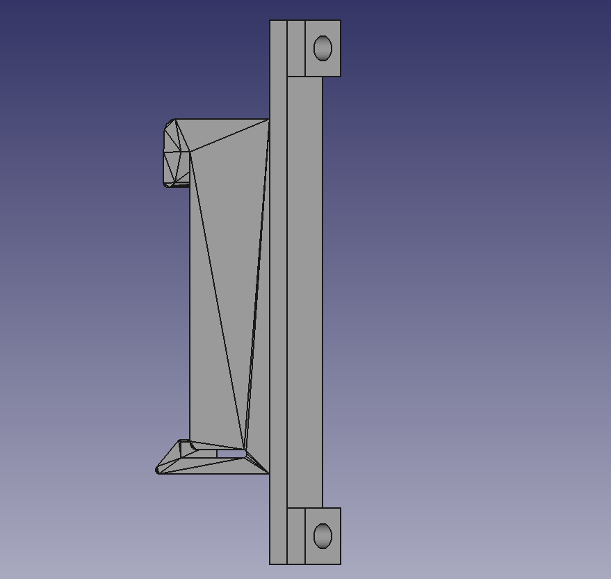

# PCB DIN Rail mount

Clip for mounting a PCB to DIN rail.

The 59mm version is compatible Raspberry Pi and AZ-Delivery XL4016 step-down DC/DC.

## Print option

- **Material:** PETG

- **Supports:** NO

## License

Creative Commons - Attribution - Share Alike

## Credits

Created from: http://www.thingiverse.com/thing:1393685
